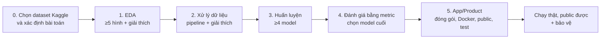
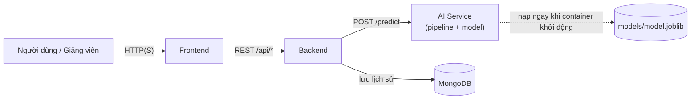
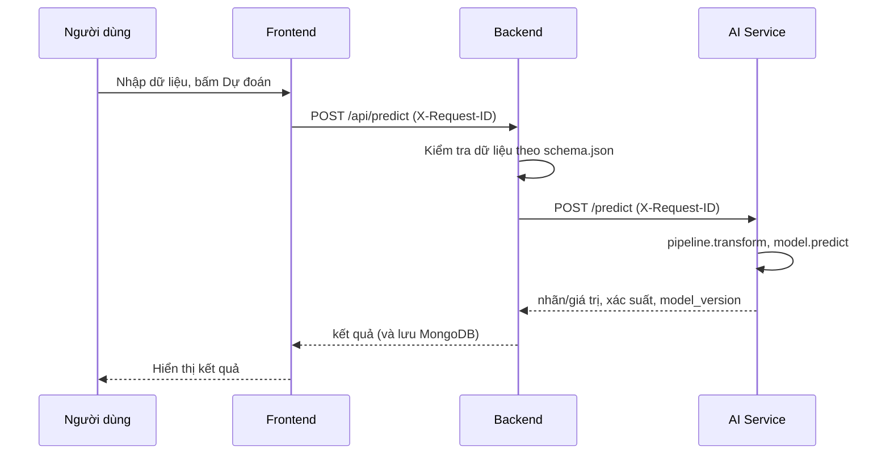

# Quy trình làm Bài tập lớn – Học máy cơ bản

> Học phần: **Học máy cơ bản (221180)** · Lớp **12523W.2** · Giảng viên: Nguyễn Đức Tuấn Anh · Phiên bản 2.0 (23/09/2026)

Tài liệu này mô tả **toàn bộ quy trình** làm bài tập lớn: từ dữ liệu Kaggle, huấn luyện model, đến một sản phẩm **chạy thật, public được ra ngoài** mà bất kỳ ai cũng có thể mở lên dùng thử và kiểm tra hiệu năng.

Hãy đọc hết một lượt trước khi bắt đầu. Dùng phần [Checklist nghiệm thu](#checklist-nghiệm-thu) trước khi nộp và trước ngày bảo vệ.

**Cách đọc các nhãn trong tài liệu**

- **[Bắt buộc]**: yêu cầu của môn học, thiếu là không đạt.
- **[Khuyến nghị]**: không bắt buộc nhưng giúp hệ thống chạy ổn định và dễ bảo vệ.

---

## Tóm tắt nhanh

| Hạng mục | Yêu cầu |
|---|---|
| Dữ liệu | Lấy từ **Kaggle**, nguồn uy tín |
| EDA | **Tối thiểu 5 hình vẽ**, mỗi hình có giải thích |
| Xử lý dữ liệu | Quy trình rõ ràng, **giải thích từng bước** |
| Model | **Tối thiểu 4 model** cho cùng một bài toán |
| Đánh giá | Metric phù hợp, **giải thích model tốt/xấu**, chọn ra model tốt nhất |
| Đóng gói model | Biết rõ **model nằm ở đâu trong repo** và **cách export** ra khỏi Colab/máy huấn luyện |
| Docker | Cả **AI Service lẫn App (FE+BE)** đều chạy Docker; model **nạp ngay khi container khởi động**; kiểm tra được **trạng thái port**; xem được **log mỗi request**; các container **kết nối thông** với nhau |
| Triển khai | Public bằng **IP tĩnh hoặc tunnel/ngrok** đều được; địa chỉ luôn đọc qua **`.env`**, đổi cổng/tunnel phải **ghi log**; không có IP tĩnh thì phải **cập nhật link mỗi sáng thứ Hai** |
| Git | Repo **public**; **commit đầu tiên + báo cáo Word** chậm nhất **18h30 ngày 25/09/2026**; ⚠️ **≥2 người cùng code phải có lịch sử merge/nhánh** |
| Slide | Đã đẩy lên repo chậm nhất **6h30 ngày 28/09/2026** (thời điểm lấy slide để dùng báo cáo) |
| Bảo vệ | Mỗi **nhóm** trình bày **15–20 phút**, dùng **2 máy** (1 máy giữ slide, 1 máy TeamViewer cho xem vận hành thật) |

---

## Bức tranh tổng thể



### Kiến trúc hệ thống cần xây



Ba khối FE, BE, AI Service **mỗi khối một container Docker**, được nối bằng `docker-compose.yml`. AI Service có thể đặt trên cùng máy chủ với App, hoặc chạy riêng trên Colab/máy cá nhân khác — miễn là Backend gọi kết nối tới được (xem [Triển khai online](#54-triển-khai-online)).

### Luồng một lần dự đoán (đây cũng là thứ phải chỉ ra trên Máy 2 khi bảo vệ)



### Bản đồ kết nối: đầu ra của bước này là đầu vào của bước sau

Đây là phần dùng để **tự kiểm tra các bước đã nối với nhau chưa**. Nếu một dòng bị đứt, sản phẩm sẽ lỗi ở đúng chỗ đó.

| Bước | Đầu ra (artifact) | Nằm ở | Bước sau dùng để làm gì |
|---|---|---|---|
| 0. Chọn dữ liệu | `dataset.zip`, mô tả bài toán (cột mục tiêu, loại bài toán) | `ai-models/data/` | Notebook EDA đọc trực tiếp từ file zip này |
| 1. EDA | ≥5 hình + ghi chú "quyết định xử lý" | `ai-models/colab/`, `docs/figures/` | Mỗi hình dẫn tới ít nhất một quyết định ở bước 2; hình dùng lại trong slide và báo cáo |
| 2. Xử lý dữ liệu | Pipeline tiền xử lý + `schema.json` (tên cột, kiểu, khoảng giá trị, danh sách nhãn) | `ai-models/src/`, `ai-models/models/` | Huấn luyện dùng chung pipeline; **BE kiểm tra dữ liệu** và **FE dựng form** theo `schema.json` |
| 3. Huấn luyện | ≥4 model, bảng tham số đã thử | `ai-models/colab/` | Đầu vào cho bước đánh giá |
| 4. Đánh giá | Bảng so sánh metric, model được chọn và lý do | `ai-models/colab/`, `docs/` | Chọn đúng model để đóng gói |
| 5.1 Đóng gói | `model.joblib` (pipeline + model), `metadata.json` | `ai-models/models/` | AI Service nạp file này **ngay khi container khởi động** |
| 5.2–5.3 App + Docker | AI Service, BE, FE, `docker-compose.yml`, `.env.example` | `app/`, `ai-models/` | Đem đi public |
| 5.4 Public | Địa chỉ AI Service, địa chỉ App (deploy hoặc tunnel/ngrok) | `.env`, `README.md` | Người khác truy cập và test |
| 5.5–5.6 Test và log | Báo cáo hiệu năng, log request, trạng thái port | `docs/`, `README.md` | Dùng trong buổi bảo vệ |

**Các điểm nhất quán phải kiểm tra** (thường hỏng ở đây):

1. **Cùng một danh sách đặc trưng** ở EDA, pipeline, model, `schema.json`, validate ở BE và form ở FE (đúng tên cột, đúng thứ tự, đúng kiểu).
2. **Tiền xử lý lúc dự đoán phải giống hệt lúc huấn luyện.** Lưu pipeline **cùng với model**, không viết lại bằng tay ở BE.
3. **Cùng phiên bản thư viện** giữa Colab và Docker (đặc biệt `scikit-learn`, `numpy`, `pandas`). File model lưu bằng phiên bản này có thể lỗi hoặc cho kết quả sai khi nạp bằng phiên bản khác.
4. **Cùng ánh xạ nhãn** (0/1 ứng với lớp nào) từ huấn luyện đến giao diện.
5. **Metric hiển thị trên app** (ở `/model-info` hoặc trang giới thiệu) đúng là metric của model đã chọn ở bước 4.
6. **Địa chỉ/cổng giữa các service luôn đọc từ `.env`**, không hardcode `localhost` hay IP cố định trong code. Khi chạy local dùng tên service trong Docker network (ví dụ `http://ai-service:8001`); khi public thì `.env` trỏ sang địa chỉ deploy hoặc link tunnel/ngrok. **Mỗi lần cổng/tunnel đổi địa chỉ phải ghi log lại** (thời điểm đổi + địa chỉ mới) và cập nhật `.env`.

---

## Cấu trúc repo

**[Bắt buộc]** Repo Git có các thành phần sau. Tên thư mục và bộ khung file theo **boilerplate do giảng viên cung cấp**:

- App: *[link boilerplate App – giảng viên bổ sung]*
- AI Models: *[link boilerplate AI Models – giảng viên bổ sung]*

**Quy tắc đặt tên và cấu trúc:**

- **Tên dự án (`<ten-du-an>`)**: đặt theo đúng quy ước lớp đã dùng để nộp slide/Drive, dạng `<Số nhóm>_<MSSV1>_<MSSV2>_<TênĐềTàiViếtTắt>` *(ví dụ minh hoạ: `07_10123078_12523118_HocMayCoBan` — giảng viên xác nhận lại nếu muốn đổi mẫu)*.
- **Các thư mục cấp cao nhất phải giống nhau ở mọi nhóm**: `app/`, `ai-models/`, `docs/`, cùng 3 file `docker-compose.yml`, `.env.example`, `.gitignore`, `README.md` — đúng tên, đúng vị trí như cây thư mục bên dưới, **không đổi tên hay bỏ bớt**. Đây là phần boilerplate dùng để giảng viên chấm nhanh và nhất quán giữa các nhóm.
- **Bên trong mỗi thư mục thì mỗi nhóm được tự do tổ chức** (file cụ thể trong `frontend/`, `backend/`, `service/`, cách chia module, đặt tên biến/hàm, …), miễn hệ thống vẫn chạy đúng qua `docker compose up --build`.

```text
<ten-du-an>/
├── app/                        # [Bắt buộc] Sản phẩm
│   ├── frontend/               #   FE (có Dockerfile)
│   └── backend/                #   BE (có Dockerfile, tests/)
├── ai-models/                  # [Bắt buộc] Mọi thứ về model
│   ├── colab/                  #   Notebook Colab: 01_eda, 02_preprocess, 03_train, 04_evaluate
│   ├── src/                    #   File xử lý đi kèm (.py): preprocess, train, evaluate
│   ├── data/
│   │   └── dataset.zip         #   Dataset Kaggle dạng zip + DATA.md (nguồn, giấy phép)
│   ├── models/                 #   model.joblib, schema.json, metadata.json
│   ├── service/                #   AI Service (API dự đoán, có Dockerfile, tests/)
│   └── requirements.txt        #   Ghim phiên bản
├── docs/                       # [Bắt buộc] Tài liệu
│   ├── slide.pptx
│   ├── baocao.docx
│   └── figures/                #   Hình EDA, biểu đồ so sánh model
├── docker-compose.yml          # [Bắt buộc] Chạy cả hệ thống bằng một lệnh
├── .env.example                # Mẫu biến môi trường (KHÔNG chứa mật khẩu thật)
├── .gitignore
└── README.md                   # [Bắt buộc] Mô tả bài toán, cài đặt, triển khai
```

---

## Quy tắc Git

> [!CAUTION]
> **Bắt buộc phải có lịch sử merge khi từ 2 người trở lên cùng code chung một phần** (ví dụ cùng làm Backend, cùng sửa AI Service). Mỗi người làm trên **nhánh (branch) riêng** rồi **merge lại bằng `git merge` hoặc Pull Request** — không được để một người commit đè thẳng lên `main` xoá mất phần việc của người kia. Lịch sử git phải thấy rõ: nhánh của từng người, commit riêng của từng người, và **commit merge thể hiện đúng phiên làm việc chung**. Đây là nội dung ưu tiên kiểm tra; thiếu lịch sử merge khi rõ ràng có ≥2 người cùng code sẽ bị coi là **không đạt yêu cầu Git**.

**[Bắt buộc]**

- Repo ở trạng thái **public**. Kiểm tra bằng cách mở link trong cửa sổ ẩn danh, phải xem được mà không cần đăng nhập.
- **Chậm nhất 18h30 ngày 25/09/2026** (giờ Việt Nam, GMT+7): repo phải có **commit đầu tiên** và đã kèm **báo cáo Word** (`docs/baocao.docx`). Ngày giờ commit được kiểm tra trực tiếp từ lịch sử git.
- **Chậm nhất 6h30 ngày 28/09/2026**: file **slide** (`docs/slide.pptx`) phải có trên repo. Đây là thời điểm sẽ lấy đúng bản slide đang có trên repo để dùng cho buổi bảo vệ, nộp muộn hơn giờ này sẽ không kịp cập nhật.
- **Không sửa lịch sử**: không `force push`, không `rebase` làm đổi ngày, không tạo commit giả ngày.
- Repo phải do nhóm tự tạo. **Không fork hoặc sao chép** lịch sử commit của nhóm khác.
- **Mỗi thành viên có commit của chính mình** (đúng tài khoản/tên tác giả), thể hiện được phần việc đã làm.
- Đủ các thành phần: `app/`, `ai-models/`, `docs/`, `README.md`.
- Dataset đẩy lên dưới dạng **file zip**.
- **Không đưa bí mật lên Git**: `kaggle.json`, chuỗi kết nối MongoDB, token, mật khẩu, file `.env`. Chỉ commit `.env.example`.
- Nếu triển khai bằng **tunnel/ngrok (không có IP tĩnh)**: mỗi khi link đổi phải cập nhật `.env` và mục "Demo online" trong `README.md`, kèm ghi log thời điểm đổi. Việc này lặp lại **mỗi sáng thứ Hai hàng tuần** cho đến ngày bảo vệ. Nhóm cấu hình được IP tĩnh thì không cần làm việc này.

**[Khuyến nghị]**

- Giới hạn của GitHub: cảnh báo file > 50 MB, **chặn file > 100 MB**. Nên chọn dataset để file zip nhỏ hơn 50 MB. Nếu dataset lớn hơn: đẩy một bản mẫu đủ chạy notebook, kèm link Kaggle và script tải toàn bộ, hoặc dùng Git LFS.
- Commit nhỏ, thường xuyên, message rõ ràng (ví dụ `feat: add EDA notebook`, `fix: scaler mismatch in service`).
- Gắn tag `v1.0` cho bản nộp chính thức.
- Thêm GitHub Actions chạy `docker compose build` và test cho mỗi lần push.

---

## Bước 1 – EDA (phân tích khám phá dữ liệu)

**[Bắt buộc]** Tối thiểu **5 hình vẽ**, mỗi hình phải có phần giải thích.

Mỗi hình viết ngắn theo 3 ý:

1. **Hình cho thấy gì?** (quan sát cụ thể, có con số)
2. **Ý nghĩa với bài toán?**
3. **Quyết định xử lý tiếp theo?** (nối sang bước 2, ví dụ "cột X lệch phải nên lấy log", "cột Y thiếu 30% nên điền median")

Gợi ý các hình (chọn ≥5, nên đa dạng loại biểu đồ):

| Hình | Trả lời câu hỏi |
|---|---|
| Phân bố biến mục tiêu (countplot/histogram) | Dữ liệu có mất cân bằng không? Loại bài toán là gì? |
| Phân bố biến số (histogram/boxplot) | Lệch không? Có ngoại lai không? |
| Bản đồ dữ liệu thiếu | Cột nào thiếu, thiếu bao nhiêu, có quy luật không? |
| Heatmap tương quan | Đặc trưng nào liên quan tới mục tiêu? Cặp nào trùng thông tin? |
| Đặc trưng vs mục tiêu (boxplot/violin/countplot) | Đặc trưng nào phân biệt được các lớp/giá trị? |
| Scatter/pairplot các đặc trưng chính | Quan hệ tuyến tính hay phi tuyến? Có cụm không? |

Lưu hình vào `docs/figures/` để dùng lại trong slide và báo cáo.

---

## Bước 2 – Quy trình xử lý dữ liệu

**[Bắt buộc]** Trình bày rõ quy trình và **giải thích lý do cho từng bước**, không chỉ liệt kê lệnh.

| Bước | Làm gì | Câu hỏi "vì sao" phải trả lời được |
|---|---|---|
| Kiểm tra ban đầu | Kiểu dữ liệu, trùng lặp, giá trị thiếu, giá trị vô lý | Dữ liệu có đáng tin không? |
| Làm sạch | Xử lý thiếu (median/mode/loại bỏ), trùng lặp, ngoại lai (giữ/cắt/bỏ) | Vì sao chọn cách này thay vì cách khác? |
| Tạo/chọn đặc trưng | Tạo cột mới, bỏ cột không dùng được | Đặc trưng mới mang thông tin gì? |
| Mã hóa | One-Hot / Ordinal cho biến phân loại | Vì sao chọn kiểu mã hóa này? |
| Chuẩn hóa | StandardScaler / MinMax | Model nào cần (KNN, SVM), model nào không (cây)? |
| Chia dữ liệu | Train/Test (thêm validation hoặc cross-validation) | Vì sao tỉ lệ này? Có `stratify` với bài toán phân loại không? |
| Xử lý mất cân bằng (nếu có) | `class_weight` hoặc lấy mẫu lại | Chỉ áp dụng trên tập train (xem lưu ý dưới) |

**Lưu ý quan trọng: tránh rò rỉ dữ liệu (data leakage).**

- **Chia dữ liệu trước**, sau đó mới `fit` scaler/encoder/imputer **chỉ trên tập train**, rồi `transform` tập test.
- Cách dễ nhất là gói toàn bộ vào một `sklearn Pipeline`/`ColumnTransformer`.
- Loại các cột "biết trước đáp án" (ví dụ cột được sinh ra từ mục tiêu).
- Cố định `random_state` để kết quả lặp lại được.

**Đầu ra của bước này (để bước sau dùng):**

- Pipeline tiền xử lý (lưu được ra file, dùng lại ở AI Service).
- `schema.json`: tên cột, kiểu, khoảng giá trị hợp lệ, danh sách nhãn.

---

## Bước 3 – Huấn luyện tối thiểu 4 model

**[Bắt buộc]** Ít nhất **4 model** cho cùng một bài toán, cùng cách chia dữ liệu, cùng metric để so sánh công bằng. Cả nhóm phải hiểu và giải thích được cả 4 model (giảng viên có thể hỏi bất kỳ ai về bất kỳ model nào), không chia hẳn "người này chỉ biết model của mình".

**[Khuyến nghị]** Chọn model thuộc nhiều họ khác nhau để có gì đó để so sánh và giải thích:

| Họ | Ví dụ |
|---|---|
| Mốc so sánh (baseline) | Dummy, Logistic Regression / Linear Regression |
| Dựa trên khoảng cách | KNN |
| Xác suất | Naive Bayes |
| Biên/kernel | SVM |
| Ensemble (bagging) | Random Forest |
| Ensemble (boosting) | Gradient Boosting, XGBoost |

Cách làm:

- Dùng một model **baseline** đơn giản để biết "thế nào là tốt hơn ngẫu nhiên".
- Tinh chỉnh siêu tham số bằng `GridSearchCV`/`RandomizedSearchCV` **trên tập train** (cross-validation). **Chỉ dùng tập test một lần** cho kết quả cuối.
- Ghi lại với mỗi model: siêu tham số đã thử và giá trị chọn (ví dụ vì sao chọn K trong KNN), thời gian huấn luyện, **thời gian dự đoán**, **kích thước file model**. Hai chỉ số sau ảnh hưởng trực tiếp đến việc deploy ở bước 5.

---

## Bước 4 – Metric đánh giá và giải thích tốt/xấu

**[Bắt buộc]** Chọn metric phù hợp với bài toán, và **giải thích vì sao model tốt hoặc xấu**.

| Loại bài toán | Metric thường dùng | Ghi chú |
|---|---|---|
| Phân loại | Accuracy, Precision, Recall, F1, ROC-AUC, PR-AUC, ma trận nhầm lẫn | Dữ liệu mất cân bằng thì **không dùng mỗi Accuracy** |
| Hồi quy | MAE, RMSE, R² | MAPE sai lệch khi giá trị thật gần 0 |

Không có ngưỡng "tốt" tuyệt đối. Khi giải thích phải dựa trên:

1. **So với baseline**: model có thật sự hơn model đơn giản không?
2. **Train so với test**: chênh lệch lớn nghĩa là **overfitting**; cả hai đều thấp nghĩa là **underfitting**.
3. **Ý nghĩa thực tế của lỗi**: bỏ sót ca dương (FN) và báo nhầm (FP) cái nào nguy hiểm hơn? Từ đó chọn Recall hay Precision làm trọng tâm.
4. **Phân tích lỗi**: xem ma trận nhầm lẫn (phân loại) hoặc biểu đồ phần dư (hồi quy), chỉ ra model sai ở đâu.

**Chọn model cuối:** không chỉ nhìn điểm cao nhất. Cân nhắc thêm thời gian dự đoán, kích thước file, độ ổn định (độ lệch chuẩn giữa các fold) và khả năng chạy trên máy chủ/tunnel đang dùng. Ghi rõ lý do chọn trong báo cáo.

**Bảng so sánh mẫu (đưa vào báo cáo và slide):**

| Model | Metric chính (test) | Metric phụ | Train so với test | Thời gian dự đoán | Kích thước file | Nhận xét |
|---|---|---|---|---|---|---|
| Baseline | | | | | | |
| Model 1 | | | | | | |
| Model 2 | | | | | | |
| Model 3 | | | | | | |
| Model 4 | | | | | | |

---

## Bước 5 – App/Product

Bước này gồm các bước con, trong đó **5.1 là bước "cầu nối"** giữa thế giới notebook và sản phẩm, rất hay bị bỏ sót.

### 5.1. Đóng gói model (cầu nối giữa Colab và App)

**[Bắt buộc]**

- Lưu **pipeline + model thành một file** (ví dụ `joblib.dump(pipeline, "model.joblib")`), hoặc dùng ONNX.
- Kèm `metadata.json`: tên model, `model_version`, metric đã đạt, ngày huấn luyện, **phiên bản `scikit-learn`/`numpy`/`pandas` đã dùng**.
- Kèm `schema.json` (từ bước 2).
- **Biết rõ và giải thích được**: model nằm ở file/đường dẫn nào trong repo (ví dụ `ai-models/models/model.joblib`), và **cách export** file đó ra từ Colab/máy huấn luyện để đưa vào AI Service (tải về, đẩy lên Git, hoặc script đồng bộ). Đây là nội dung sẽ được hỏi khi bảo vệ.

**[Khuyến nghị]**

- Ghim đúng các phiên bản thư viện trong `requirements.txt` của AI Service. Trong Colab, in ra `sklearn.__version__` để đối chiếu.
- File model nên nhỏ (dưới 50 MB, xem giới hạn GitHub ở mục Git). Nếu quá lớn: giảm số cây, nén (`joblib.dump(..., compress=3)`), hoặc chọn model nhẹ hơn.

### 5.2. Kiến trúc và hợp đồng API

**[Bắt buộc]** FE + BE + AI model, mỗi phần chạy trong Docker.

| Thành phần | Trách nhiệm | Endpoint gợi ý |
|---|---|---|
| **AI Service** | Nạp `model.joblib` **ngay khi container khởi động**; nhận đặc trưng, trả kết quả | `POST /predict`, `GET /health`, `GET /model-info` |
| **Backend** | Kiểm tra dữ liệu theo `schema.json`; gọi AI Service; lưu lịch sử (MongoDB); xử lý lỗi | `POST /api/predict`, `GET /api/history`, `GET /health` |
| **Frontend** | Form nhập liệu dựng theo `schema.json`; hiển thị kết quả; hiển thị tên model và metric | Trang chủ, trang kết quả/lịch sử |

**[Khuyến nghị]** Thống nhất hợp đồng dữ liệu ngay từ đầu để FE và AI làm song song được:

```jsonc
// Yêu cầu:  POST /api/predict
{ "features": { "cot_1": 12.5, "cot_2": "A", "cot_3": 3 } }

// Phản hồi thành công
{ "prediction": "class_1", "probability": 0.87, "model_version": "1.0.0", "request_id": "7f3a…" }

// Phản hồi lỗi (dữ liệu không hợp lệ)
{ "error": "invalid_input", "detail": "cot_2 phải thuộc {A, B, C}", "request_id": "7f3a…" }
```

Các điểm nên làm: kiểm tra dữ liệu đầu vào ở BE và AI Service (không tin dữ liệu từ FE), trả mã lỗi HTTP đúng (400 cho dữ liệu sai, 5xx cho lỗi hệ thống), bật CORS đúng domain FE, có trang tài liệu API tự sinh (`/docs` nếu dùng FastAPI).

### 5.3. Docker

**[Bắt buộc]**

- Chạy trên Docker cho **cả AI Service lẫn App (FE + BE)**. Cả hệ thống phải lên được trên máy sạch (chỉ cài Docker) bằng đúng một lệnh:

  ```bash
  cp .env.example .env
  docker compose up --build
  ```

- **Model được nạp ngay khi container AI Service khởi động** (trong lúc container start, không đợi request đầu tiên mới nạp).
- **Kiểm tra được trạng thái từng port/service** đang online: `docker compose ps` (trạng thái container) và endpoint `GET /health` của mỗi service (trả về ít nhất tình trạng, cổng, thời gian đã chạy).
- **Xem được log mỗi khi có request gọi tới** (xem chi tiết ở mục [Log và khả năng quan sát](#56-log-và-khả-năng-quan-sát)).
- **Các container phải kết nối thông suốt với nhau** qua mạng của `docker-compose.yml`, dùng tên service (không dùng `localhost`/IP cứng). Tự kiểm tra trên máy bằng cách gọi thử luồng FE → BE → AI Service trước khi public.

Khung minh hoạ `docker-compose.yml` (tên thư mục theo boilerplate):

```yaml
services:
  ai-service:
    build: ./ai-models
    ports: ["8001:8001"]
    healthcheck:
      test: ["CMD", "python", "-c", "import urllib.request; urllib.request.urlopen('http://localhost:8001/health')"]
      interval: 10s
      timeout: 3s
      retries: 5

  backend:
    build: ./app/backend
    ports: ["8000:8000"]
    environment:
      - AI_SERVICE_URL=${AI_SERVICE_URL}   # doc tu .env: ten service khi chay local, hoac link public/tunnel
      - MONGODB_URI=${MONGODB_URI}
    depends_on:
      ai-service:
        condition: service_healthy

  frontend:
    build: ./app/frontend
    ports: ["3000:80"]
    environment:
      - API_URL=${API_URL}                 # doc tu .env: doi theo dia chi public/tunnel hien tai
    depends_on: [backend]
```

**[Khuyến nghị]**

- Mỗi service có `Dockerfile` riêng, dùng image nhỏ (`python:3.x-slim`), `.dockerignore`.
- Không "nhúng" bí mật vào image; đọc từ biến môi trường.
- Nếu AI Service chạy trên Colab: giữ notebook/container chạy xuyên suốt lúc test và bảo vệ, public bằng tunnel/ngrok (xem mục tiếp theo).

### 5.4. Triển khai online

**[Bắt buộc]**

- Cả **AI Service lẫn App (FE + BE)** phải public ra ngoài để người khác dùng thật. Chấp nhận **một trong hai cách**:
  1. Deploy lên nền tảng cloud có địa chỉ cố định (Render, …).
  2. Chạy Docker trên **máy cá nhân hoặc Colab**, public bằng **IP tĩnh hoặc tunnel (ngrok hoặc tương đương)** — được chấp nhận làm sản phẩm chính thức của đợt này.
- Dù AI Service chạy ở đâu (cloud, máy cá nhân, hay Colab), Backend cũng phải **gọi kết nối tới được** địa chỉ đó — tự kiểm tra bằng một request thử thành công trước khi báo là xong.
- Mọi địa chỉ/cổng (`API_URL`, `AI_SERVICE_URL`, …) đọc từ **`.env`**, không hardcode trong code.
- **Mỗi lần cổng/tunnel đổi địa chỉ**: ghi log lại (thời điểm đổi + địa chỉ mới), cập nhật `.env`, và cập nhật mục "Demo online" trong `README.md` của nhóm rồi push lên Git.
- **Nếu không cấu hình được IP tĩnh** (ví dụ ngrok bản miễn phí đổi link mỗi lần khởi động lại): nhóm phải bật lại hệ thống và cập nhật link mới **vào sáng thứ Hai hàng tuần**, trước khi giảng viên kiểm tra định kỳ. Có IP tĩnh thì không cần lặp lại việc này.

Gợi ý nền tảng deploy cloud (được phép dùng GitHub, Vercel, Render, MongoDB, …):

| Thành phần | Nơi chạy gợi ý | Ghi chú |
|---|---|---|
| Frontend | Vercel hoặc GitHub Pages | Vercel **không chạy container Docker**, chỉ phù hợp cho FE. FE vẫn nên có Dockerfile để chạy bằng `docker compose` |
| Backend | Render (Web Service dạng Docker) hoặc nền tảng tương đương | Trỏ tới thư mục `app/backend`, cấu hình health check `/health` |
| AI Service | Render (Web Service dạng Docker), máy cá nhân, hoặc Colab | Nếu dùng Colab/máy cá nhân: public bằng ngrok/tunnel, xem yêu cầu ở trên |
| Cơ sở dữ liệu | MongoDB Atlas (gói miễn phí) | Cấu hình cho phép truy cập từ máy chủ deploy; giữ chuỗi kết nối trong biến môi trường |

Lưu ý chung (áp dụng cho cả deploy cloud lẫn máy cá nhân/Colab):

- Dịch vụ cloud miễn phí thường **"ngủ" sau một thời gian không có truy cập**; máy cá nhân/Colab thì có thể tắt máy hoặc hết phiên. Cần **"làm nóng" hệ thống trước khi bảo vệ** và trước mỗi lần giảng viên kiểm tra.
- **RAM thường ít** trên gói miễn phí/Colab. Nạp model **một lần lúc khởi động**, không nạp lại mỗi request.
- Sau khi public: kiểm tra **FE → BE → AI → FE** chạy thông trên **địa chỉ thật** (không chỉ trên máy mình). Lỗi hay gặp: sai CORS, còn trỏ `localhost`, thiếu biến môi trường, sai địa chỉ giữa các service, quên cập nhật `.env` khi tunnel đổi link.

### 5.5. Kiểm thử và hiệu năng

Sản phẩm sẽ được người khác vào test, **kể cả kiểm tra hiệu năng**. Nhóm phải tự test trước và ghi lại kết quả.

| Loại | Việc cần làm | Công cụ gợi ý |
|---|---|---|
| Kiểm thử chức năng | Test API (dữ liệu đúng, dữ liệu sai, thiếu trường); test model nạp được | `pytest` (có sẵn trong boilerplate) |
| Smoke test sau khi public | Mở địa chỉ public, gửi 1 request hoàn chỉnh, xem log 3 service | Trình duyệt, `curl` |
| Tải (load test) | Nhiều người dùng đồng thời gọi `/api/predict` | k6, Locust, Apache Bench |
| Hiệu năng giao diện | Điểm tải trang, kích thước tài nguyên | Lighthouse (Chrome DevTools) |

**[Khuyến nghị]** Ghi vào `README.md` và báo cáo: số người dùng đồng thời và thời lượng test, số request/giây, thời gian phản hồi p50/p95, tỉ lệ lỗi, và **ngưỡng chịu tải của hệ thống**. Mục tiêu gợi ý (giảng viên có thể điều chỉnh): 10–20 người dùng đồng thời trong 1 phút, tỉ lệ lỗi dưới 1%, p95 dưới 2 giây cho `/api/predict` khi hệ thống đã "nóng".

### 5.6. Log và khả năng quan sát

**[Bắt buộc]** Log phải xem được **mỗi khi có request gọi tới**, và phải "kể" được câu chuyện của một request đi qua từng cấu phần — đây là nội dung Máy 2 sẽ trình chiếu khi bảo vệ.

Mỗi service ghi log có cấu trúc, cùng có `request_id` để lần theo một request qua 3 service:

```text
10:15:02 INFO  frontend  req=7f3a  click Dự đoán -> POST /api/predict
10:15:02 INFO  backend   req=7f3a  validate OK -> gọi ai-service
10:15:02 INFO  ai-service req=7f3a  predict class_1 p=0.87 model=1.0.0 in 12ms
10:15:02 INFO  backend   req=7f3a  200 OK total 84ms, saved history
```

- Không ghi dữ liệu nhạy cảm vào log.
- Cách xem log: `docker compose logs -f <service>` khi chạy local hoặc trên máy cá nhân/Colab; với bản deploy cloud thì mở trang **Logs** của từng dịch vụ.
- Mỗi lần cổng/tunnel đổi địa chỉ cũng ghi log lại thời điểm đổi (xem [Triển khai online](#54-triển-khai-online)).
- Chuẩn bị sẵn sơ đồ kiến trúc (phần "Kiến trúc hệ thống cần xây") và luồng request (phần "Luồng một lần dự đoán") để chỉ vào khi giải thích.

---

## Tài liệu nộp (thư mục `docs/`)

**[Bắt buộc]**

- **Báo cáo Word** (`docs/baocao.docx`): phải có trên repo cùng với commit đầu tiên, chậm nhất **18h30 ngày 25/09/2026**.
- **Slide** (`docs/slide.pptx`): phải có trên repo chậm nhất **6h30 ngày 28/09/2026** — đây là thời điểm lấy đúng bản đang có trên repo để dùng khi báo cáo.

**Mục lục báo cáo Word gợi ý** (bám theo quy trình):

1. Giới thiệu bài toán và dữ liệu (nguồn Kaggle, mô tả cột, loại bài toán)
2. EDA (≥5 hình, mỗi hình có giải thích)
3. Xử lý dữ liệu (quy trình và lý do)
4. Các model (nguyên lý, tham số, cách tinh chỉnh)
5. Đánh giá và so sánh (bảng metric, giải thích tốt/xấu, lý do chọn model cuối)
6. Đóng gói model (nằm ở đâu trong repo, cách export)
7. Thiết kế hệ thống (kiến trúc, hợp đồng API, Docker)
8. Triển khai (địa chỉ public, nền tảng/tunnel, cấu hình `.env`)
9. Kiểm thử và hiệu năng
10. Kết luận, hạn chế, hướng phát triển
11. **Phân công công việc** của từng thành viên
12. Tài liệu tham khảo; phụ lục hướng dẫn chạy

---

## `README.md` của repo (nhóm phải viết)

`README.md` là bộ mặt của repo, người chấm đọc đầu tiên. **[Bắt buộc]** mô tả bài toán, các bước cài đặt, triển khai, và **phải cập nhật lại mỗi khi địa chỉ public thay đổi** (đặc biệt nếu dùng tunnel/ngrok, cập nhật vào mỗi sáng thứ Hai). Khung gợi ý:

```markdown
# Tên dự án
## 1. Thành viên (họ tên, MSSV, phần việc)
## 2. Bài toán (mô tả, loại bài toán, cột mục tiêu, ý nghĩa thực tế)
## 3. Dữ liệu (link Kaggle, giấy phép, mô tả cột, cách giải nén dataset.zip)
## 4. Kết quả model (bảng so sánh metric, model được chọn và lý do)
## 5. Đóng gói model (đường dẫn file model trong repo, cách export từ Colab)
## 6. Kiến trúc hệ thống (sơ đồ FE - BE - AI - DB)
## 7. Chạy trên máy (yêu cầu: Docker; lệnh: cp .env.example .env; docker compose up --build)
## 8. Huấn luyện lại model (link Colab, thứ tự chạy notebook)
## 9. Biến môi trường (bảng từng biến, ý nghĩa)
## 10. Triển khai (cách public: deploy/tunnel, các bước, cách cập nhật khi đổi link)
## 11. Demo online (địa chỉ App, địa chỉ AI Service/docs — cập nhật mỗi khi đổi)
## 12. Nhật ký đổi cổng/tunnel (thời điểm đổi, địa chỉ cũ → mới)
## 13. Kết quả kiểm thử hiệu năng
## 14. Hạn chế và hướng phát triển
```

---

## Bảo vệ

### Thể thức

- Mỗi **nhóm** trình bày trong khoảng **15–20 phút** (chưa tính hỏi đáp).
- Dùng **2 máy** cùng lúc:
  - **Máy 1**: trình chiếu slide, giữ nguyên slide xuyên suốt phần trình bày, không chuyển sang cửa sổ khác.
  - **Máy 2**: dùng **TeamViewer** (hoặc phần mềm điều khiển từ xa tương đương) để chuyển cảnh, cho xem hệ thống đang **vận hành thật**: log theo từng request, trạng thái container/port, cách FE – BE – AI Service kết nối và gọi nhau.
- Giảng viên có thể hỏi bất kỳ thành viên nào về toàn bộ quy trình; cả nhóm phải nắm được cả pipeline, không chỉ phần mình làm.

### Nội dung ưu tiên khi trình bày

1. Hiểu bài toán và **toàn bộ quy trình**: từ dữ liệu → xử lý dữ liệu → chọn bài toán → chọn model, giải thích được vì sao đi từ bước này sang bước kia.
2. **EDA**: tối thiểu 5 hình, giải thích được từng hình.
3. **Hiểu từng model** đã dùng: nguyên lý, tham số quan trọng, cách chọn tham số.
4. **Hiểu và giải thích được metric**: vì sao chọn metric này, nó nói lên điều gì về việc model tốt hay xấu.
5. **Đánh giá, so sánh và chỉ ra model tốt nhất**, kèm lý do.
6. **Đóng gói và triển khai model**: model nằm ở đường dẫn nào trong repo, cách export ra khỏi Colab để đưa vào AI Service.
7. **Demo trực tiếp** sản phẩm đang chạy thật (không phải ảnh chụp có sẵn), cho xem log và luồng kết nối giữa các cấu phần trên Máy 2.

### Kịch bản demo (nên tập trước)

1. Mở địa chỉ public (deploy hoặc qua tunnel/ngrok) trên trình duyệt, dùng cửa sổ mới, không dùng cache.
2. Nhập một mẫu dữ liệu, bấm dự đoán, cho xem kết quả.
3. **Chuyển sang Máy 2 (qua TeamViewer)**: chỉ ra dòng log của cùng `request_id` đi qua FE → BE → AI Service, cho thấy độ trễ từng chặng.
4. Cho xem trạng thái container/port đang chạy (`docker compose ps`, endpoint `GET /health`, `GET /model-info`) và vị trí file model trong repo.
5. Thử một dữ liệu sai để cho thấy hệ thống báo lỗi đúng cách.

### Chuẩn bị trước ngày bảo vệ

- [ ] Có **≥2 máy** đã sạc đầy, mang theo sạc và cổng chuyển hình (HDMI/USB-C); tắt chế độ ngủ, tắt thông báo.
- [ ] **Internet ổn định**: dùng mạng có dây/Wi-Fi tốt và có **điểm phát 4G dự phòng** đã thử trước.
- [ ] Máy 2 đã cài và đăng nhập sẵn **TeamViewer** (hoặc phần mềm tương đương), thử kết nối trước.
- [ ] Nếu dùng tunnel/ngrok: đã cập nhật link mới nhất (kể cả nếu chưa tới sáng thứ Hai), đã **làm nóng** hệ thống 10–15 phút trước khi vào.
- [ ] Đã **chạy thử nguyên kịch bản demo** ít nhất một lần, có tính giờ, trong khoảng 15–20 phút.
- [ ] Phương án dự phòng: bản `docker compose up` chạy local trên máy 2 (đã build sẵn image), bản quay màn hình demo. **Dự phòng chỉ để cứu tình huống, không thay thế bản chạy thật.**

---

## Checklist nghiệm thu

Nhóm tự tick từng mục trước khi nộp.

**Dữ liệu và model**

- [ ] Dữ liệu lấy từ Kaggle, nguồn uy tín, có giấy phép trong `DATA.md`
- [ ] EDA có ≥5 hình, **mỗi hình có giải thích** và quyết định xử lý
- [ ] Quy trình xử lý dữ liệu có giải thích, không rò rỉ dữ liệu (chia trước, fit trên train)
- [ ] ≥4 model, cùng cách chia dữ liệu và cùng metric, có baseline
- [ ] Có bảng so sánh metric và giải thích model tốt/xấu vì sao, lý do chọn model cuối
- [ ] Notebook Colab chạy được từ đầu đến cuối (Restart & Run All), đường dẫn tới `dataset.zip` đúng

**Đóng gói và kết nối các thành phần**

- [ ] Biết rõ model nằm ở đường dẫn nào trong repo và cách export ra khỏi Colab
- [ ] `model.joblib` chứa cả pipeline; `schema.json` và `metadata.json` có mặt
- [ ] Danh sách đặc trưng khớp ở: pipeline, `schema.json`, BE (validate), FE (form)
- [ ] Phiên bản thư viện ghim và khớp giữa Colab và `requirements.txt`
- [ ] Không có `localhost`/IP cố định trong code; mọi địa chỉ lấy từ `.env`

**Docker và vận hành**

- [ ] `docker compose up --build` chạy được trên máy sạch, cả AI Service và App
- [ ] Model được nạp **ngay khi container khởi động**, không nạp lại mỗi request
- [ ] Kiểm tra được trạng thái từng port/service (`docker compose ps`, `/health`)
- [ ] Các container kết nối thông với nhau qua tên service trong `docker-compose.yml`
- [ ] Log in được ngay khi có request gọi tới, có `request_id` xuyên suốt

**Triển khai và public**

- [ ] AI Service và App đều public được (deploy cloud, hoặc IP tĩnh/tunnel trên máy cá nhân/Colab)
- [ ] Luồng FE → BE → AI → FE chạy thông trên địa chỉ public thật
- [ ] Mỗi lần đổi cổng/tunnel đã ghi log và cập nhật `.env`
- [ ] Nếu không có IP tĩnh: đã có kế hoạch/thói quen cập nhật link mỗi sáng thứ Hai
- [ ] Đã test hiệu năng và ghi kết quả, biết ngưỡng chịu tải

**Git và tài liệu**

- [ ] Repo public (mở bằng cửa sổ ẩn danh xem được)
- [ ] Commit đầu tiên và báo cáo Word đã có trước **18h30 ngày 25/09/2026**; mỗi thành viên có commit của mình; không sửa lịch sử
- [ ] **Nếu ≥2 người cùng code cùng một phần: có nhánh riêng + commit merge rõ ràng trong lịch sử git** (không phải một người commit đè)
- [ ] Slide đã có trên repo trước **6h30 ngày 28/09/2026**
- [ ] Có `app/`, `ai-models/` (Colab + file xử lý + dataset zip), `docs/`, `README.md`
- [ ] `README.md` đủ các mục ở phần khung; không có bí mật trong repo

**Bảo vệ**

- [ ] Trình bày đúng 15–20 phút/nhóm, đúng thứ tự nội dung ưu tiên
- [ ] 2 máy sẵn sàng (máy giữ slide + máy TeamViewer), Internet dự phòng, hệ thống đã làm nóng

---

## Những điều không chấp nhận

- **Máy gặp sự cố** trong ngày bảo vệ (vì vậy phải chuẩn bị dự phòng như phần "Chuẩn bị trước ngày bảo vệ").
- **Internet không ổn định** khi trình bày.
- Sản phẩm **không public được** khi kiểm tra (không chạy được cả bằng IP tĩnh lẫn tunnel, dịch vụ "ngủ" không ai đánh thức).
- **Hardcode địa chỉ/cổng** trong code thay vì đọc từ `.env`.
- **Đổi cổng/tunnel mà không ghi log** lại thời điểm và địa chỉ mới.
- Không có IP tĩnh mà cũng **không cập nhật link vào sáng thứ Hai** hàng tuần.
- Repo **private**, hoặc không có **commit đầu tiên + báo cáo Word trước 18h30 ngày 25/09/2026**.
- Từ **2 người cùng code nhưng không có lịch sử merge/nhánh** (chỉ một người commit đè lên phần của người kia).
- **Slide không có trên repo trước 6h30 ngày 28/09/2026**.
- Dùng bài của người khác (sao chép repo, lịch sử commit trùng nhau).
- Để lộ bí mật (mật khẩu, token, chuỗi kết nối) trong repo.

---

## Tài liệu tham khảo

- Kaggle: https://www.kaggle.com
- scikit-learn: https://scikit-learn.org
- Docker: https://docs.docker.com
- ngrok: https://ngrok.com/docs
- Render: https://render.com/docs
- Vercel: https://vercel.com/docs
- MongoDB Atlas: https://www.mongodb.com/atlas
- FastAPI: https://fastapi.tiangolo.com
- k6 (load test): https://k6.io/docs
- Locust (load test): https://locust.io
